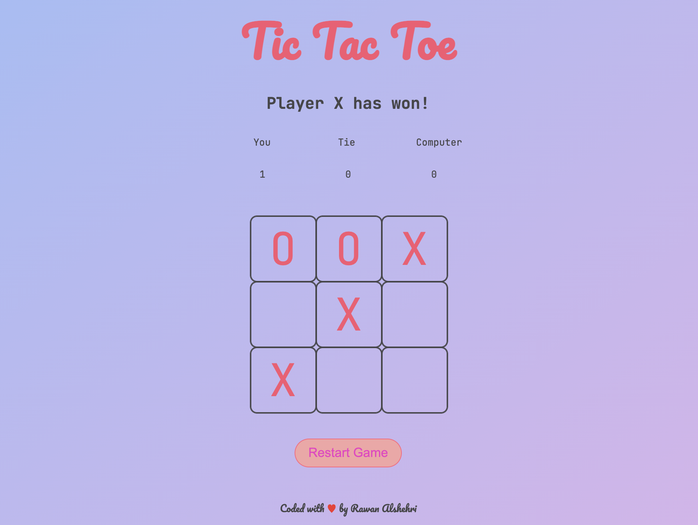
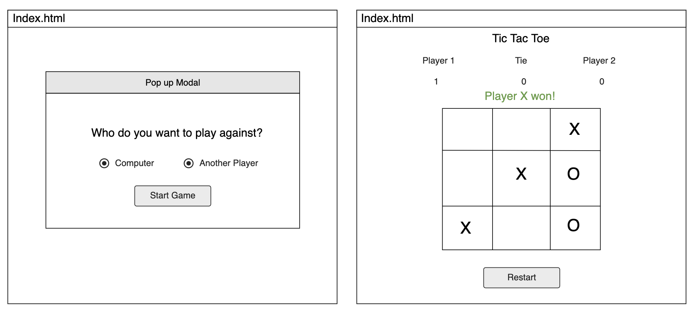

# Tic Tac Toe Game
Tic-Tac-Toe involves looking ahead and trying to figure out what the person playing against you might do next.

### Rules for TIC-TAC-TOE:
1. The game is played on a grid that's 3 squares by 3 squares.
2. You are X, your friend (or the computer in this case) is O. Players take turns putting their marks in empty squares.
3. The first player to get 3 of her marks in a row (up, down, across, or diagonally) is the winner.
4. When all 9 squares are full, the game is over. If no player has 3 marks in a row, the game ends in a tie.
### How to become a winner:
* To beat the computer (or at least tie), you need to make use of a little bit of strategy. Strategy means figuring out what you need to do to win.

* Part of your strategy is trying to figure out how to get three Xs in a row. The other part is trying to figure out how to stop the computer from getting three Os in a row.
### List of technologies used in this project:
* HTML5
* CSS
* JavaScript
* Visual Studio Code
* Moqups Wireframes
### Wireframes:

### User Stories:
* As a player, i want to be able to choose between playing with another player or the computer.
* As a player, i want to be able to know when is my turn and when is the other player's turn.
* As a player, i want to be able to see how many times i won, how many times there's a tie, and how many times the other player/computer won.
* As a player, i want to be able to restart the game without losing the wins and ties counts.
### Planning/Development process and problem-solving strategy:
1.  Create New Repository in GitHub Enterprise
2.  Prepare the folders and files for the game
3.  Create README.md
4.  Create index.html
5.  Create style.css
6.  Create game.js
7.  Create wireframe
8.  Write user stories
9.  Write index.html as the main page of the game
10. Design the index.html by using css on style.css
11. Pesudocode the logic of the game before coding in JS.
12. Start coding the basic functions on game.js
10. Gradually add more features to the game.
### Unsolved Problems:
None.
### Future Improvements:
* Adding AI instead of using random function for the computer player.
* Saving the counters even after refreshing the page.
